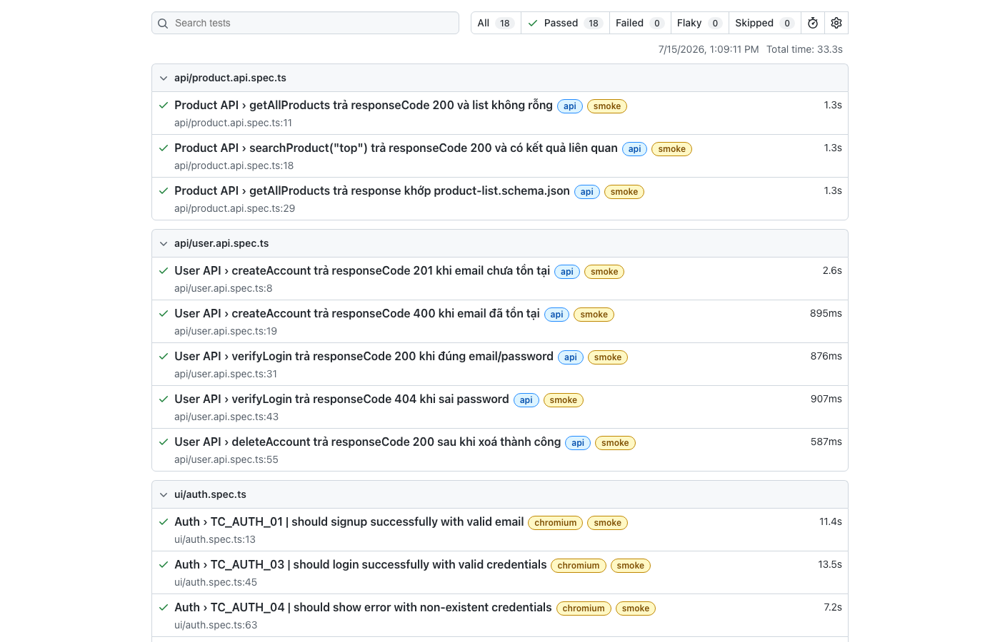
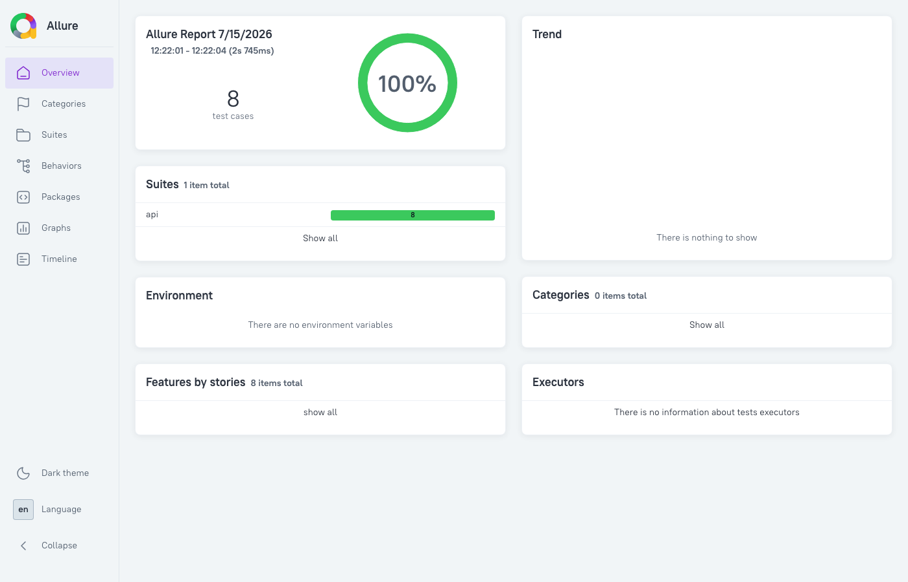

# AutomationExercise – Playwright + TypeScript


A Page Object Model automation framework built with Playwright + TypeScript for [automationexercise.com](https://automationexercise.com), covering both **UI and API testing** across **Staging / UAT / Prod** environments. The suite currently ships **46 tests** (38 UI across Chromium + Firefox, 8 API), tagged `@smoke` / `@regression` and wired into a GitHub Actions pipeline with a smoke-on-PR gating strategy.

## ✨ Highlights

- 🏗 **Page Object Model + fixture-based DI** — page objects and services are injected through Playwright fixtures (`pages.fixture.ts`, `user.fixture.ts`); tests never instantiate a page object manually.
- ⚡ **API-seeded test data** — account setup goes through the REST API instead of the UI signup form (`apiUser` fixture), cutting suite runtime by ~35% compared to signing up through the UI every test.
- 🌍 **Multi-environment config** — a single `TEST_ENV` switch (`staging` / `uat` / `prod`) drives which `.env.*` file, base URL, and API endpoint get loaded.
- 🏷 **Smoke/regression tagging** — every test carries `@smoke` or `@regression`, mapped 1:1 to the `Type` column in the test plan, runnable independently via `npm run test:smoke` / `test:regression`.
- 🔁 **CI with a smoke-on-PR strategy** — pull requests run the `@smoke` subset for fast feedback (~1 min); pushes to `main`/`master` run the full suite.
- 🧩 **JSON Schema contract testing** — API responses are validated against JSON Schema (ajv) so a breaking API contract change fails CI instead of silently passing.

## 🛠 Tech stack

| Category | Tool |
|---|---|
| Test runner | [Playwright Test](https://playwright.dev/) (`@playwright/test`) |
| Language | TypeScript |
| API testing | Playwright `APIRequestContext` wrapped in a custom `ApiClient` |
| Schema validation | [ajv](https://ajv.js.org/) (JSON Schema draft-07) |
| Reporting | Playwright HTML reporter, [Allure](https://allurereport.org/) (`allure-playwright`) |
| Test data | `csv-parse` (static negative cases) + dynamic generators (positive cases) |
| Env management | `dotenv`, per-environment `.env.*` files |
| CI/CD | GitHub Actions |

## 🚀 Getting started

**Prerequisites**: Node.js 18+, Java 8+ (only needed to generate/open Allure reports locally).

```bash
git clone https://github.com/BTuyen/automationexercise-playwright.git
cd automationexercise-playwright

npm ci
npx playwright install --with-deps

cp .env.example .env.staging   # fill in TEST_USER_EMAIL / TEST_USER_PASSWORD if needed

npm test                       # full suite, staging by default
npm run test:smoke             # fast subset
```

## 📁 Project structure

```
automationexercise-playwright/
├── pages/                  # Page Objects (POM) - one class per page
│   ├── base.page.ts        # shared locators/actions (logout, delete account, cart modal...)
│   ├── auth/                # LoginPage, SignupPage
│   ├── product/              # ProductPage, ProductDetailPage
│   ├── cart/                 # CartPage
│   └── checkout/              # CheckoutPage, PaymentPage
├── services/                # API service layer (one class per resource)
│   ├── user.service.ts      # createAccount / verifyLogin / deleteAccount
│   └── product.service.ts   # getAllProducts / searchProduct
├── models/                  # TypeScript types shared between services, fixtures, schemas
├── schemas/                  # JSON Schema contracts, validated with ajv
├── helpers/                  # ApiClient, CSV handler, schema-validator, signup flow helper
├── utils/                    # env loader, random data generators
├── fixtures/
│   ├── pages.fixture.ts     # injects page objects + services (userService, productService)
│   └── user.fixture.ts      # apiUser fixture - account seeded via API, auto-cleaned after test
├── tests/
│   ├── ui/                  # UI specs (auth, cart, checkout, home)
│   └── api/                 # API specs (user, product)
├── resources/
│   └── testdata/             # static test data (CSV for negative/EP cases)
├── docs/
│   ├── test-plan.md
│   ├── test-cases.md
│   └── bugs/                 # bug reports found while testing (see below)
├── .github/workflows/        # CI pipeline (GitHub Actions)
└── .env.example               # env var template (real .env.* files are gitignored)
```

## 📜 Scripts

| Command | Description |
|---|---|
| `npm test` | Run the full suite (staging by default) |
| `npm run test:staging` / `test:uat` / `test:prod` | Run against a specific environment |
| `npm run test:smoke` | Run only `@smoke`-tagged tests |
| `npm run test:regression` | Run only `@regression`-tagged tests |
| `npm run test:ui-mode` | Open Playwright's interactive UI mode |
| `npm run test:headed` | Run with a visible browser |
| `npm run report` | Open the last Playwright HTML report |
| `npm run report:allure` | Generate and open the Allure report |

## 📊 Reports

**Playwright HTML report** — per-test timeline, tags, screenshots/video/trace on failure:



**Allure report** — trend, suites, and categories view, generated from the same run:



## 🧪 Test design

- [Test plan](docs/test-plan.md)
- [Test cases](docs/test-cases.md) — 25 documented cases (Auth / Cart / Checkout), each with Priority and Type (`smoke`/`regression`), including EP/BVA-designed cases for the signup form.
- [Architecture](docs/ARCHITECTURE.md) — layer diagram, what each file exports, and the recipe for adding new pages/services/tests.

## 🐛 Bugs found

Found while testing — not simulated, each verified against the live site with reproduction steps and screenshot evidence in [`docs/bugs/`](docs/bugs/):

| ID | Title | Severity / Priority |
|---|---|---|
| [BUG_001](docs/bugs/BUG_001.md) | Negative quantity accepted, drags cart & checkout total negative | High / High |
| [BUG_002](docs/bugs/BUG_002.md) | No minimum password length enforced (1-character password accepted) | Medium / Medium |
| [BUG_003](docs/bugs/BUG_003.md) | Email not case-normalized — same address can register twice | Medium / Low |

## 🔁 CI/CD

GitHub Actions ([`.github/workflows/playwright.yml`](.github/workflows/playwright.yml)) runs on every push to `main`/`master`, every PR, and on-demand via `workflow_dispatch`. **Pull requests run `@smoke` only** for a fast pass/fail signal before merge; **pushes to `main`/`master` run the full suite** (`@smoke` + `@regression`), since that branch is the release source of truth. API tests run before UI tests in separate steps, so a dead API/site fails the job in seconds instead of waiting on the full UI run.
